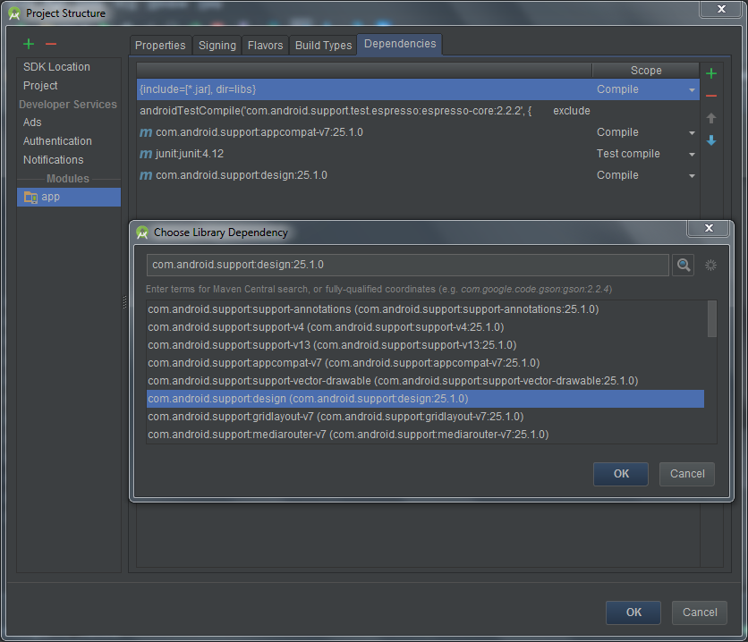
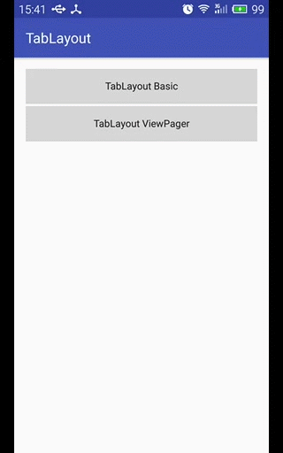
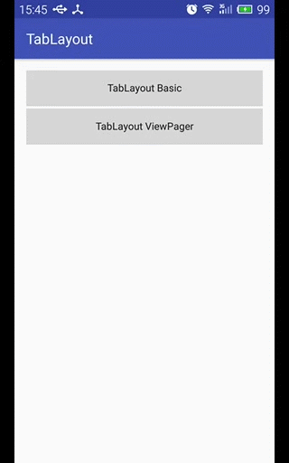
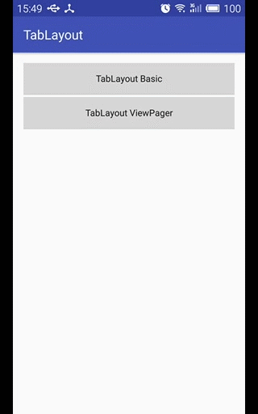

## TabLayout

#### 常见XML属性说明

|属性|说明|
|----|----|
|app:tabIndicatorColor|tab中滚动的指示横线颜色|
|app:tabSelectedTextColor|被选中的tab子项的文本颜色|
|app:tabTextColor|tab子项默认的文本颜色|

#### TabLayout基本使用

**1. 添加依赖性**

可以打开Project Structure来添加依赖库，这样可以查看到适合当前工程的版本：



从而选择了以下的依赖版本：

```
compile 'com.android.support:appcompat-v7:25.1.0'
compile 'com.android.support:design:25.1.0'
```

**2. XML布局 - activity_tab_layout_basic.xml**

```
<?xml version="1.0" encoding="utf-8"?>
<RelativeLayout xmlns:android="http://schemas.android.com/apk/res/android"
    android:id="@+id/activity_tab_layout_basic"
    android:layout_width="match_parent"
    android:layout_height="match_parent">

    <android.support.design.widget.TabLayout
        android:id="@+id/tl_tab_layout"
        android:layout_width="match_parent"
        android:layout_height="wrap_content" />

    <LinearLayout
        android:layout_width="match_parent"
        android:layout_height="wrap_content"
        android:layout_below="@id/tl_tab_layout"
        android:layout_margin="16dp"
        android:orientation="vertical">

        <LinearLayout
            android:layout_width="match_parent"
            android:layout_height="wrap_content"
            android:gravity="center_vertical"
            android:orientation="horizontal">

            <TextView
                android:layout_width="0dp"
                android:layout_height="wrap_content"
                android:layout_weight="1"
                android:text="TabMode:"
                android:textSize="16sp" />

            <RadioGroup
                android:id="@+id/rg_tab_mode"
                android:layout_width="0dp"
                android:layout_height="wrap_content"
                android:layout_weight="2"
                android:gravity="center"
                android:orientation="horizontal">

                <RadioButton
                    android:id="@+id/rb_mode_fixed"
                    android:layout_width="0dp"
                    android:layout_height="wrap_content"
                    android:layout_weight="1"
                    android:checked="true"
                    android:text="Fixed" />

                <RadioButton
                    android:id="@+id/rb_mode_scrollable"
                    android:layout_width="0dp"
                    android:layout_height="wrap_content"
                    android:layout_weight="1"
                    android:text="Scrollable" />
            </RadioGroup>
        </LinearLayout>

        <LinearLayout
            android:layout_width="match_parent"
            android:layout_height="wrap_content"
            android:gravity="center_vertical"
            android:orientation="horizontal">

            <TextView
                android:layout_width="0dp"
                android:layout_height="wrap_content"
                android:layout_weight="1"
                android:text="TabGravity:"
                android:textSize="16sp" />

            <RadioGroup
                android:id="@+id/rg_tab_gravity"
                android:layout_width="0dp"
                android:layout_height="wrap_content"
                android:layout_weight="2"
                android:gravity="center"
                android:orientation="horizontal">

                <RadioButton
                    android:id="@+id/rb_gravity_fill"
                    android:layout_width="0dp"
                    android:layout_height="wrap_content"
                    android:layout_weight="1"
                    android:checked="true"
                    android:text="Fill" />

                <RadioButton
                    android:id="@+id/rb_gravity_center"
                    android:layout_width="0dp"
                    android:layout_height="wrap_content"
                    android:layout_weight="1"
                    android:text="Center" />
            </RadioGroup>
        </LinearLayout>
    </LinearLayout>
</RelativeLayout>
```

**3. TabLayout的初始化**

通过`newTab()`方法来得到TabLayout.Tab对象，然后进行文本设置，再使用`addTab()`方法添加到TabLayout中去。
其中通过`public void addTab(@NonNull Tab tab, boolean setSelected)`重载方法可以同时设置是否默认被选中。

```
mTabLayout = (TabLayout) findViewById(R.id.tl_tab_layout);

TabLayout.Tab mChatsTab = mTabLayout.newTab().setText("Chats");
mTabLayout.addTab(mChatsTab);

TabLayout.Tab mContactsTab = mTabLayout.newTab().setText("Contacts");
mTabLayout.addTab(mContactsTab);

TabLayout.Tab mDiscoverTab = mTabLayout.newTab().setText("Discover");
//mTabLayout.addTab(mDiscoverTab);          // 默认第一个项被选中
mTabLayout.addTab(mDiscoverTab, true);      // 设置为默认选中项

// TabMode
// TabLayout.MODE_FIXED
// TabLayout.MODE_SCROLLABLE
mTabLayout.setTabMode(TabLayout.MODE_FIXED);   // default

// setOnTabSelectedListener()方法已过时
mTabLayout.addOnTabSelectedListener(new TabLayout.OnTabSelectedListener() {
    @Override
    public void onTabSelected(TabLayout.Tab tab) {
        Toast.makeText(TabLayoutBasicActivity.this, "Selected: " + tab.getText(), Toast.LENGTH_SHORT).show();
    }

    @Override
    public void onTabUnselected(TabLayout.Tab tab) {

    }

    @Override
    public void onTabReselected(TabLayout.Tab tab) {

    }
});
```

效果如下：



**4. TabMode设置**

```
mFixedModeRb = (RadioButton) findViewById(R.id.rb_mode_fixed);
mScrollableModeRb = (RadioButton) findViewById(R.id.rb_mode_scrollable);
mTabModeRg = (RadioGroup) findViewById(R.id.rg_tab_mode);
mTabModeRg.setOnCheckedChangeListener(new RadioGroup.OnCheckedChangeListener() {
    @Override
    public void onCheckedChanged(RadioGroup group, int checkedId) {
        switch (checkedId) {
            case R.id.rb_mode_fixed:
                mTabLayout.setTabMode(TabLayout.MODE_FIXED);
                break;
            case R.id.rb_mode_scrollable:
                mTabLayout.setTabMode(TabLayout.MODE_SCROLLABLE);
                break;
        }
    }
});
```

效果如下：



**5. TabGravity设置**

需要说明的是：TabGravity只在TabMode为TabLayout.MODE_FIXED时才会生效。

```
mFillGravityTb = (RadioButton) findViewById(R.id.rb_gravity_fill);
mCenterGravityTb = (RadioButton) findViewById(R.id.rb_gravity_center);
mTabGravityRg = (RadioGroup) findViewById(R.id.rg_tab_gravity);
mTabGravityRg.setOnCheckedChangeListener(new RadioGroup.OnCheckedChangeListener() {
    @Override
    public void onCheckedChanged(RadioGroup group, int checkedId) {
        switch (checkedId) {
            case R.id.rb_gravity_fill:
                mTabLayout.setTabGravity(TabLayout.GRAVITY_FILL);
                break;
            case R.id.rb_gravity_center:
                mTabLayout.setTabGravity(TabLayout.GRAVITY_CENTER);
                break;
        }
    }
});
```

效果如下：



#### TabLayout和ViewPager的关联

一般TabLayout会结合ViewPager来实现一个选项卡的Tab切换效果，而在TabLayout中关联ViewPager也很简单。

**1. XML布局 - activity_tab_layout_view_pager.xml**

```
<?xml version="1.0" encoding="utf-8"?>
<LinearLayout xmlns:android="http://schemas.android.com/apk/res/android"
    android:id="@+id/activity_tab_layout_view_pager"
    android:layout_width="match_parent"
    android:layout_height="match_parent"
    android:orientation="vertical">

    <android.support.design.widget.TabLayout
        android:id="@+id/tl_tab"
        android:layout_width="match_parent"
        android:layout_height="wrap_content" />

    <android.support.v4.view.ViewPager
        android:id="@+id/vp_pager"
        android:layout_width="match_parent"
        android:layout_height="0dp"
        android:layout_weight="1" />
</LinearLayout>
```

**2. TabLayout与ViewPager的初始化及关联**

首先自定义一个用于ViewPager的页面适配器TabPagerAdapter，初始化ViewPager后，使用`TabLayout`中的`setupWithViewPager()`方法来关联`ViewPager`即可。

```
public class TabLayoutViewPagerActivity extends AppCompatActivity {

    private TabLayout mTabLayout;
    private ViewPager mViewPager;

    private String[] mTitleArray = {"Chats", "Contacts", "Discover", "Me"};


    @Override
    protected void onCreate(Bundle savedInstanceState) {
        super.onCreate(savedInstanceState);
        setContentView(R.layout.activity_tab_layout_view_pager);

        // ViewPager
        mViewPager = (ViewPager) findViewById(R.id.vp_pager);
        TabPagerAdapter adapter = new TabPagerAdapter();
        mViewPager.setAdapter(adapter);

        // TabLayout
        mTabLayout = (TabLayout) findViewById(R.id.tl_tab);
        mTabLayout.setTabMode(TabLayout.MODE_FIXED);    // 默认模式，可以不设置
        mTabLayout.setupWithViewPager(mViewPager);      // ViewPager <---> TabLayout
    }

    // 自定义ViewPager页面适配器
    public class TabPagerAdapter extends PagerAdapter {

        @Override
        public int getCount() {
            return mTitleArray.length;
        }

        @Override
        public boolean isViewFromObject(View view, Object object) {
            return view == object;
        }

        @Override
        public Object instantiateItem(ViewGroup container, int position) {
            TextView tv = new TextView(TabLayoutViewPagerActivity.this);
            tv.setText(mTitleArray[position]);
            tv.setGravity(Gravity.CENTER);
            container.addView(tv, ViewPager.LayoutParams.MATCH_PARENT, ViewPager.LayoutParams.WRAP_CONTENT);
            return tv;
        }

        @Override
        public void destroyItem(ViewGroup container, int position, Object object) {
            container.removeView((View) object);
        }

        @Override
        public CharSequence getPageTitle(int position) {
            return mTitleArray[position];
        }
    }
}
```

效果如下：


## Links:
 
**AigeStudio: [TabLayout：另一种Tab的实现方式](http://blog.csdn.net/aigestudio/article/details/47155769)**

**Google官方文档：https://developer.android.google.cn/reference/android/support/design/widget/TabLayout.html**
